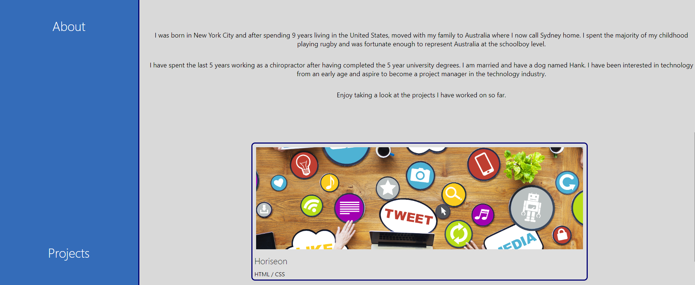

# HTML + CSS Portfolio

## By Mackenzie Gray

## Technologies Used

- HTML
- CSS

# Description

The motivation for this project is to create a portfolio of work samples for potential employers to view that highlights samples of work. This is done to assess if the candidate is suitable for the position being offered. 

Portfolios are used by working professionals, companies and students to highlight their completed works, display skills and outline skill and potential.

### Outline of changes made

#### Codebase Writing Overview

HTML:
- Creation of meta-data and linking to style.css
- Writing of general structure of body with 
 tags within to specify sections within the page.
- Added header with navigation bar and hero image of recent headshot.
- Added side bar to distinguish sections within the content section of the page.
- Writing of sections detailing information about me, projects worked on with associated links to projects and contact section with links to Email, LinkedIn and GitHub.
- Added footer at bottom of the page. 

CSS:
- Writing of style code for general styling such as colours, font family and size to body.
- Added pseudo-classes for anchor tags and images.
- Added anchor tags to projects with hyperlink references to the deployed application. 
- Changed style types for unordered lists within the page.
- Added properties for flex box for the page to allow for flexible responsive layout structure. 
- Styling of images across the page.
- Writing of media query code to allow for changes to display so that the viewport is tailored to desktop, tablet and mobile phones. 

### Website URL
[Click here to view](https://mdkgray.github.io/portfolio_mackenzie/)

### Screenshots

